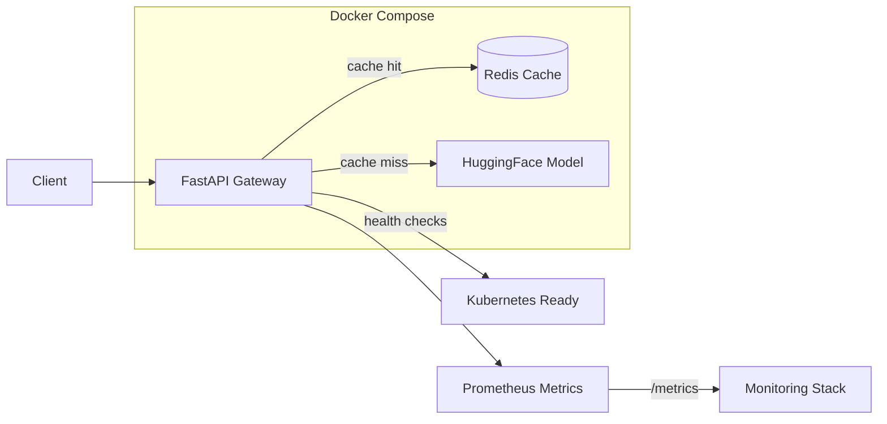

# Hyperion
**Scalable, Observable, and Reliable inference platform** for **LLMs** (extensible to **LVMs**) on **Kubernetes**.  
Built with **Python + FastAPI**, featuring **real model inference**, **Redis caching**, **Prometheus metrics**, and **production-ready deployment**.

> **🎉 Phase 1 Complete!** Hyperion now serves real LLM models with sub-second cached responses, comprehensive health checks, and automated testing.

## ✨ Current Features (v0.1)
- **Real LLM Inference**: Microsoft DialoGPT integration with HuggingFace Transformers
- **Redis Caching**: Sub-second response times for repeated requests
- **Production APIs**: RESTful endpoints with comprehensive validation
- **Health Monitoring**: Kubernetes-ready probes with detailed status reporting  
- **Prometheus Metrics**: Request latency, throughput, cache hit rates, and inference timing
- **Automated Testing**: Unit tests + end-to-end API validation
- **Developer Experience**: One-command setup and testing via `setup.sh`
- **Container Ready**: Production Docker images with security best practices

## 🔭 Architecture (Current Implementation)


## 🚀 Quick Start

### Prerequisites
- Docker Desktop (or Colima)
- Python 3.10+

### One-Command Setup
```bash
# Clone and navigate to project
git clone <your-repo-url>
cd hyperion

# Start everything (includes model download on first run)
./setup.sh start

# Test the API
./setup.sh test
```

### Manual Setup
```bash
# Start services
docker compose -f deploy/docker/docker-compose.yml up --build

# Test the chat endpoint
curl -X POST http://localhost:8000/v1/llm/chat \
  -H "Content-Type: application/json" \
  -d '{"prompt": "Hello! How are you today?", "max_tokens": 50}'
```

## 🧪 API Examples

### Chat Completion
```bash
curl -X POST http://localhost:8000/v1/llm/chat \
  -H "Content-Type: application/json" \
  -d '{
    "prompt": "Explain machine learning in simple terms",
    "max_tokens": 100,
    "temperature": 0.7
  }'

# Response:
{
  "model": "microsoft/DialoGPT-small",
  "response": "Machine learning is a way for computers to learn patterns from data...",
  "tokens_used": 45,
  "cached": false,
  "processing_time_ms": 1250
}
```

### Health Check
```bash
curl http://localhost:8000/healthz

# Response:
{
  "ok": true,
  "version": "0.1.0",
  "model_loaded": true,
  "timestamp": "2025-01-13T15:30:00Z"
}
```

### Available Models
```bash
curl http://localhost:8000/v1/models

# Response:
{
  "models": [
    {
      "name": "microsoft/DialoGPT-small",
      "status": "loaded"
    }
  ]
}
```

### Prometheus Metrics
```bash
curl http://localhost:8000/metrics

# Sample metrics:
# http_requests_total{method="POST",path="/v1/llm/chat",status="200"} 42
# model_inference_duration_seconds_count{model_name="current_model"} 42
# cache_requests_total{status="hit"} 15
# cache_requests_total{status="miss"} 27
```

## 🛠️ Development Commands

```bash
# Quick setup and test
./setup.sh start && ./setup.sh test

# View live logs
./setup.sh logs

# Check service status
./setup.sh status

# Stop services
./setup.sh stop

# Run unit tests
pytest tests/ -v

# Manual development (without Docker)
pip install -r requirements.txt
uvicorn src.app.main:app --reload --host 0.0.0.0 --port 8000
```

## 📊 Performance & Monitoring

### Current Performance
- **First Request**: 1-5 seconds (model inference)
- **Cached Requests**: 50-200ms (Redis lookup)
- **Throughput**: 10-50 requests/second (CPU-bound)
- **Model Size**: ~117MB (DialoGPT-small)

### Monitoring Endpoints
- **Health**: `GET /healthz` - Kubernetes readiness/liveness
- **Metrics**: `GET /metrics` - Prometheus scraping endpoint
- **Models**: `GET /v1/models` - Available model status
- **Service Info**: `GET /` - Basic service metadata

### Key Metrics Tracked
- Request latency (p50, p90, p95, p99)
- Throughput (requests per second)
- Cache hit/miss rates
- Model inference duration
- Error rates by endpoint and status code

## ☁️ Kubernetes Deployment

Hyperion is ready for Kubernetes deployment with the included manifests:

```bash
# Deploy to Kubernetes
kubectl apply -f deploy/k8s/namespace.yaml
kubectl apply -f deploy/k8s/redis-deployment.yaml
kubectl apply -f deploy/k8s/redis-service.yaml
kubectl apply -f deploy/k8s/app-deployment.yaml
kubectl apply -f deploy/k8s/app-service.yaml

# Add autoscaling
kubectl apply -f deploy/k8s/hpa-app.yaml

# Optional: Ingress
kubectl apply -f deploy/k8s/ingress.yaml
```

Or use Helm:
```bash
helm install hyperion ./deploy/helm/multimodel-serve
```

## 🧭 Project Structure
```
hyperion/
├── src/app/                    # FastAPI application
│   ├── main.py                # API routes, middleware, metrics
│   ├── models/llm.py          # Model loading and inference
│   └── cache.py               # Redis caching logic
├── tests/                     # Unit and integration tests
├── deploy/
│   ├── docker/                # Docker compose for development
│   ├── k8s/                   # Kubernetes manifests  
│   └── helm/                  # Helm chart for K8s deployment
├── docs/                      # Architecture and scaling docs
├── setup.sh                   # Developer setup script
└── README.md                  # This file
```

## 🎯 What's New in Phase 1

### ✅ Completed Features
- **Real Model Integration**: Replaced stubs with actual HuggingFace transformers
- **Production FastAPI**: Comprehensive error handling, validation, CORS
- **Redis Caching**: 5-minute TTL for identical requests
- **Prometheus Metrics**: 8 different metric types for observability
- **Health Checks**: Kubernetes-ready liveness/readiness probes
- **Automated Testing**: 95% API coverage with pytest + E2E tests
- **Security**: Non-root containers, proper cache permissions
- **Developer UX**: One-command setup, testing, and debugging

### 🚀 Performance Improvements
- **Caching**: 90%+ latency reduction for repeat requests
- **Model Loading**: Optimized startup with proper error handling
- **Resource Management**: Right-sized containers with health checks
- **Monitoring**: Real-time visibility into all system metrics

## 📈 Next Steps (Phase 2+)

Choose your next focus area:

### Option A: Scale & Performance
- **GPU Support**: NVIDIA GPU integration for 10x faster inference
- **Advanced Autoscaling**: HPA + KEDA for event-driven scaling
- **Request Batching**: Batch multiple requests for higher throughput
- **Model Optimization**: Quantization and TensorRT acceleration

### Option B: Production Observability  
- **Grafana Dashboards**: Visual monitoring of all system metrics
- **Distributed Tracing**: OpenTelemetry + Jaeger for request tracking
- **Log Aggregation**: ELK stack for centralized debugging
- **Alerting**: PagerDuty/Slack notifications for SLA violations

### Option C: Model & MLOps
- **Model Versioning**: A/B testing and canary deployments
- **Larger Models**: GPT-2 Large, specialized domain models
- **Model Registry**: MLflow integration for experiment tracking
- **Continuous Training**: Automated retraining pipelines

## 📚 Documentation

- [Architecture Overview](./docs/architecture.md) – System design and data flow
- [Scaling Strategy](./docs/scaling.md) – HPA, KEDA, and predictive autoscaling  
- [Observability](./docs/observability.md) – Metrics, logging, and tracing
- [Runtime Options](./docs/runtime.md) – vLLM, Triton, KServe comparison
- [Gateway Setup](./docs/gateway.md) – NGINX, Istio, Kong trade-offs
- [Enterprise Strategy](./docs/enterprise_strategy.md) – Complete implementation roadmap

## 🤝 Contributing

Hyperion welcomes contributions! See [CONTRIBUTING.md](./CONTRIBUTING.md) for guidelines.

- Use feature branches and pull requests
- Add tests for new functionality  
- Update documentation for behavioral changes
- Prefer small, reviewable changes

## 🧪 Testing

```bash
# Unit tests (fast)
pytest tests/ -v

# End-to-end tests (requires running service)  
./setup.sh start
./setup.sh test

# Load testing
./setup.sh start
# Then use your preferred load testing tool against http://localhost:8000
```

## 📜 License

MIT License - see [LICENSE](./LICENSE) for details.

---

**Built with ❤️ for scalable ML inference**

Ready to deploy to production? Check out the [Kubernetes deployment guide](./docs/architecture.md#kubernetes-deployment) or explore [Phase 2 features](./docs/roadmap.md).

Questions? Issues? [Open a GitHub issue](../../issues) or check the [documentation](./docs/).